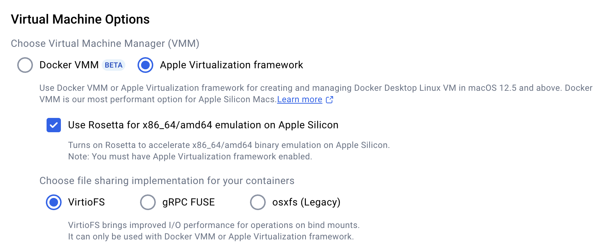

# spca

# SPCA Assignment Docker Environment

This repository provides a Docker-based environment for running SPCA assignments and labs consistently across different operating systems.

## Prerequisites

- Docker installed from [official sources](https://www.docker.com/products/docker-desktop)
- For Apple Silicon Mac users: Docker Desktop with additional configuration

## Setup Instructions

1. **Download the Dockerfile** from the Moodle page and place it in your SPCA assignments directory (referred to as `$SPCA`).
2. **Ensure the filename** is exactly `Dockerfile` without any extension.

3. **Open a terminal** in your `$SPCA` directory.

4. **Build the Docker image**:

   ```bash
   docker build --platform linux/amd64 -t sysprog .
   ```

5. **Run and enter the environment**:
   ```bash
   docker run --platform linux/amd64 -v $SPCA:/home/user --rm -it sysprog bash
   ```

## Special Instructions for Apple Silicon Mac Users

After installing Docker Desktop, check **Settings > General** and configure as shown:



### Using GDB Inside Docker on Apple Silicon Mac

Due to Rosetta-based amd64 simulation, use this special command to run GDB:

1. Enter the docker container with:

   ```bash
   docker run --platform linux/amd64 --cap-add=SYS_PTRACE --security-opt seccomp=unconfined -v $SPCA:/home/user --rm -it sysprog bash
   ```

2. Use the provided workaround script to run GDB
3. Install necessary build tools inside the container:

```bash
sudo apt update && sudo apt install build-essential flex bison
```

## Connecting to the Docker Container via SSH with VSCode

To develop inside the Docker container using VSCode's Remote SSH extension:

1. **Run the Docker container with SSH port exposed**:

   ```bash
   docker run --platform linux/amd64 -p 2222:22 -v $SPCA:/home/user --rm -it sysprog bash
   ```

   For Apple Silicon Mac users with GDB support:

   ```bash
   docker run --platform linux/amd64 --cap-add=SYS_PTRACE --security-opt seccomp=unconfined -p 2222:22 -v $SPCA:/home/user --rm -it sysprog bash
   ```

2. **Inside the container, install and start the SSH server**:

   ```bash
   sudo apt update
   sudo apt install openssh-server
   sudo service ssh start
   sudo passwd user  # Set a password for the 'user' account
   ```

3. **In VSCode, connect via Remote SSH**:
   - Install the "Remote SSH" extension if not already installed.
   - Open the command palette (Cmd+Shift+P).
   - Select "Remote-SSH: Connect to Host...".
   - Enter: `ssh user@localhost -p 2222`
   - Enter the password you set for the 'user' account.
   - Once connected, open the folder `/home/user` in VSCode.

This allows you to edit and debug your assignments directly in VSCode while running inside the Docker environment.

## Notes

- This setup has been tested and works reasonably well on Apple Silicon Macs
- If you encounter any problems, don't hesitate to ask for assistance
- Consider attempting the assignments on a Windows or Linux host machine if issues persist
- Computer lab facilities are also available as an alternative

## Support

For assistance with this Docker setup, please contact the course instructors.
